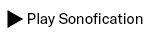

# How the Zurich Cantonal Council sounds – Wie der Zürcher Kantonsrat klingt

## Introduction
This is a sonofication of a debate of the Zurich Cantonal Council. More about the background [can be found here](https://www.nzz.ch/-ld.1689011). The data comes from a survey by the Neue Zürcher Zeitung. The [analysis can be found here](https://www.nzz.ch/-ld.1687125), the [data export here](https://github.com/simonhuwiler/nzz_zh_kantonsrat). You will find the final sonofication in the folder `export`. The sonofication was created with [Sonic Pi](https://sonic-pi.net/).

## What you hear
The President of the Cantonal Council (at that time) begins the meeting. 

> «Meine Damen und Herren, Ich begrüsse Sie zur 129 Sitzung des Kantonsrats. Die Sitzung ist eröffnet.»

> «Ladies and gentlemen, I welcome you to the 129th session of the Cantonal Council. The session is opened.»

The introduction ends with the striking of the bell.
Now men and women step up to the lectern. Each time a man speaks, you will hear a voice say "man". When a woman steps up to the lectern, "woman" is heard. The individual voices become higher and louder the more often one gender steps up to the lectern.

## Installation
### 1. install Sonic Pi
[Download Sonic Pi](https://sonic-pi.net/) and install it.

### 2. download samples
Downloaded samples "Virtual Playing Orchestra" [here](http://virtualplaying.com/virtual-playing-orchestra/) and export them to `samplesext/Virtual-Playing-Orchestra3`.

### 3. load script
Open Sonic Pi and load file `src/main.rb`.

## Contact
[journalist.sh](https://www.journalist.sh)